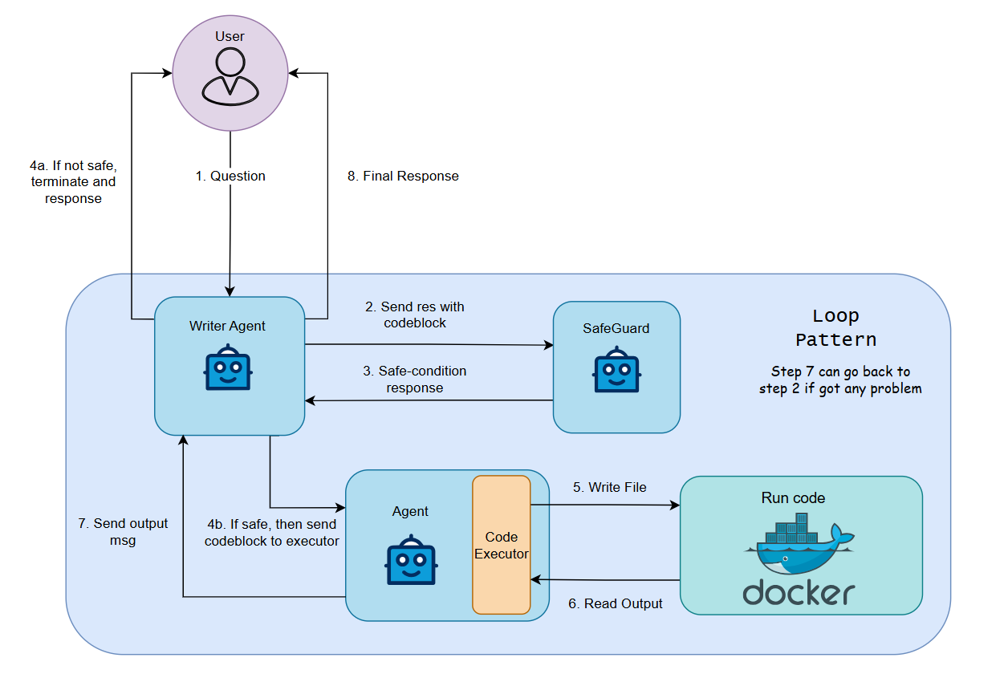

# Multi-Agent Code Execution System

## Overview
The **Multi-Agent Code Execution System** is designed to process user queries, generate code responses, ensure safety, and execute code within a controlled environment. This system leverages multiple agents working together to validate and execute code securely using Docker containers.

## Features
- **Automated Code Generation**: A Writer Agent generates code based on user queries.
- **Safety Checks**: A SafeGuard agent verifies the security of the generated code.
- **Controlled Execution**: If the code is deemed safe, an execution agent runs it in an isolated Docker environment.
- **Error Handling & Feedback Loop**: The system follows a loop pattern to refine code in case of errors or issues.

### Demo
A quick demonstration of the system in action:

## Architecture

### Components
1. **User**: Provides a query to generate a code response.
2. **Writer Agent**: Generates a response containing code.
3. **SafeGuard**: Checks the generated code for safety issues.
4. **Agent with Code Executor**: Executes safe code within a controlled environment.
5. **Docker Environment**: Runs the validated code in an isolated container.
6. **Loop Mechanism**: If execution fails, the process can loop back to refine the code.

### Process Flow
1. **User submits a query**.
2. **Writer Agent generates a code response**.
3. **SafeGuard validates the safety of the code**.
4. **If safe, the code is sent to the execution agent**.
5. **The execution agent writes the code to a file**.
6. **Docker runs the code and outputs results**.
7. **The final result is sent back to the user**.
8. **If any issue occurs, the system loops back to improve the response**.

## Implementation
For more details on the implementation, please refer to the commits in the [https://github.com/dpquoc/open-webui/tree/test](https://github.com/dpquoc/open-webui/tree/test).

## Acknowledgement
This project utilizes the user interface from [Open WebUI](https://github.com/open-webui/open-webui). Thanks to Open WebUI community for providing such a seamless user experience.
